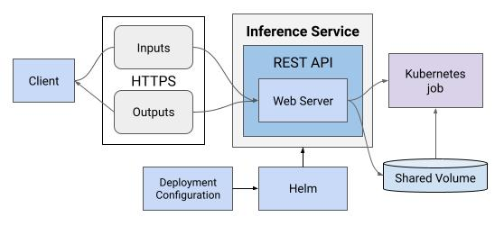

## Overview
As data scientists & application developers build AI models they need a way to deploy these applications in production. MONAI Inference Service will be used to deploy a MONAI application. This proposal documents the requirements and the design for the MONAI Inference Service (MIS).

## Goal
The goal for this proposal is to enlist, prioritize and provide clarity on the requirements for MIS. Developers working on different software modules in MIS SHALL use this specification as a guideline when designing and implementing software for the Service.

## Success Criteria
MIS SHALL provide a REST API for client to communicate with.

MIS SHALL support configuration of the [MONAI Application Package(MAP)](https://github.com/Project-MONAI/monai-deploy/blob/main/guidelines/monai-application-package.md]) used to service inference requests.

MIS SHALL provide an REST API to upload inputs to perform inferencing on.

MIS SHALL return inference results as part of the response to the originating inference request.

## Requirements

### Support for Specific MONAI Workloads
MIS SHALL support [MONAI workloads](https://github.com/Project-MONAI/monai-deploy/blob/main/guidelines/monai-workloads.md#synchronous-computational-workload) which can be completed within the timeframe of a single HTTP request/response.

### Deployable on MONAI Operating Environments
MIS SHALL run on Development/Integration Server environments as defined in [MONAI Operating Environments](https://github.com/Project-MONAI/monai-deploy/blob/main/guidelines/MONAI-Operating-Environments.md#developmentintegration-server-environment).

### API Interface
MIS SHALL provide a REST API which utilizes the functionality of the HTTP transport.

### Consistent and Robust Logging
MIS SHALL provide consistent and robust logging about its operations.

### Register single MAP configuration before MIS startup
MIS SHALL allow clients to provide MAP configuration as part of MIS' deployment configuration.

### Fulfill an inference request with uploaded file inputs
MIS SHALL fulfill an inference request with uploaded file inputs.

### Provision resources for an inference request
MIS SHALL provision CPU, memory, and GPU resources for an inference request as defined in the configuration.

### Provide results of inference request
MIS SHALL provide results of inference request as a part of the response to the request.

### SHALL NOT persist request inputs or inference results
MIS SHALL NOT persist inference request inputs or inference results beyond the lifetime of the originating inferencing request.

## Limitations
MIS SHALL service inference requests one at a time.

## Design

### Mechanism for deployment
MIS SHALL be deployed via a Helm chart in a Kubernetes cluster.

### Mechanism for MAP registration
MIS SHALL use the deployment configuration specified in the Helm charts for registering the MAP to run. 

### Mechanism for inference request handling
- Clients submit an inference request using a POST REST API call to the MIS. 
- MIS SHALL decompress the inputs provided in the inference request into a location that can be accessed by the MAP container.
- MIS SHALL deploy a [Kubernetes job](https://kubernetes.io/docs/concepts/workloads/controllers/job/) for the MAP container using the configuration specified in the Helm charts of the MIS.
- MIS SHALL then monitor the progress of the Kubernetes job.
- MIS SHALL return a success code [200 OK] (https://en.wikipedia.org/wiki/List_of_HTTP_status_codes) when the job completes along with a zipped version of the outputs.

### Detail data input and output formats
- MIS SHALL only accept inputs in a `.zip` format.  
- The zipped file inputs SHALL be decompressed and loaded directly in the input folder of a MAP.
- The output of a MAP SHALL be compressed by the MIS and sent back as a part of the response of the inference request.

### Mechanism for error handling
- If clients submit an inference request when a request is currently being fulfilled, MIS SHALL return a response with the HTTP error code 500 along with the message denoting that another inference request is currently being fulfilled.
- If the Kubernetes job does not complete within the timeout(50 seconds), MIS SHALL terminate the job and return the HTTP error code [500 Internal Server Error](https://en.wikipedia.org/wiki/List_of_HTTP_status_codes) along with the message denoting that the inference request timed out.
- If the Kubernetes job fails, MIS SHALL return a response with the HTTP error code 500 along with the message denoting that the MAP deployed for the inference request failed.

### Mechanism for logging
MIS logs can be obtained from Kubernetes.
